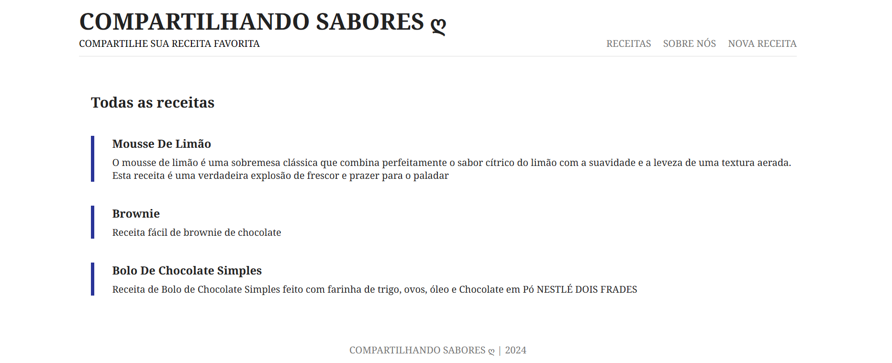
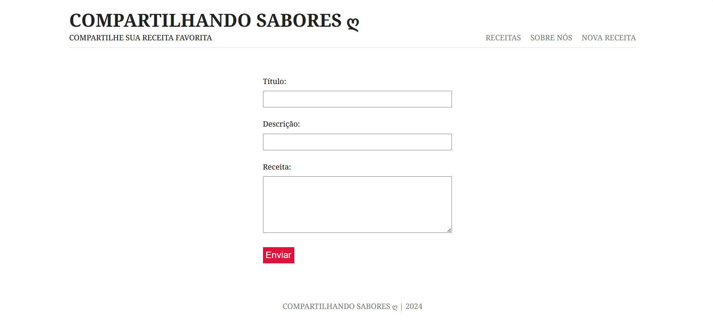

# Compartilhando Sabores - Blog de Receitas

Este projeto é um blog culinário onde é possível explorar e adicionar receitas. Todas as receitas são armazenadas em um banco de dados para facilitar o gerenciamento e garantir que fiquem salvas e acessíveis a qualquer momento.  

Nova Receita : Os usuários podem inserir os detalhes de uma nova receita que desejam compartilhar. Após preencherem o formulário e enviarem as informações, o site processa esses dados e adiciona ao banco de dados.   
  
- [Link de acesso](https://compartilhandosabores.onrender.com/blogs) ✨

## Tecnologias Utilizadas :
- Node.js
- Express
- MongoDB
- Mongoose
- EJS
- dotenv
- lodash
